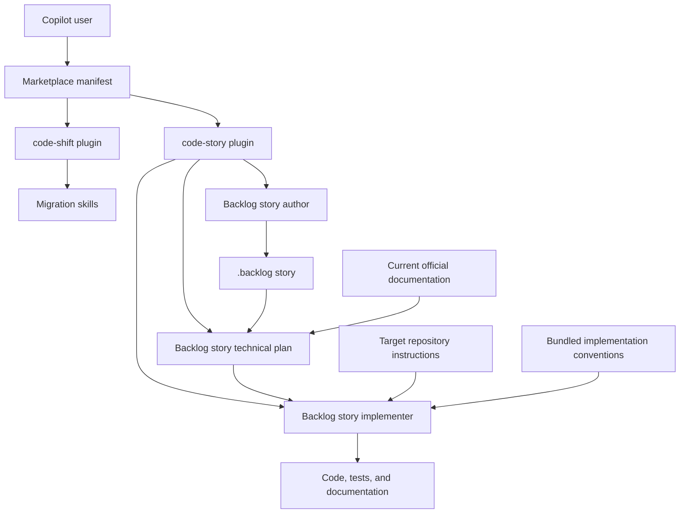

# Architecture

## Architecture

This repository is a GitHub Copilot agent-plugin marketplace. The marketplace manifest discovers independently installable plugins under `plugins/`; each plugin manifest exposes a directory of self-contained skills.

The implementer resolves target-repository instructions before the bundled conventions. The bundled reference supplies defaults for Python tooling, documentation, typing, logging, design, precision, and project documentation only where the target repository does not define a conflicting rule.